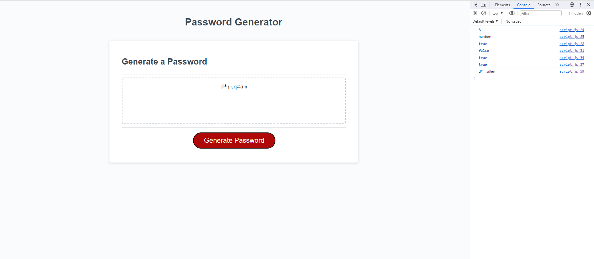

# JAVASCRIPT-PASSWORD-GENERATOR-CHALLENGE
This project is a password generator. 
* When the button is clicked, user will be presented with the following prompts:
- How long they want their password to be, with certain minimum and maximum allowed.
- What characters they want to include in their password.

* After every selection, the placeholder will display the password based on the user's selected criterias.

* The link to deployed application is https://github.com/Jenina52112/JAVASCRIPT-PASSWORD-GENERATOR-CHALLENGE.git
